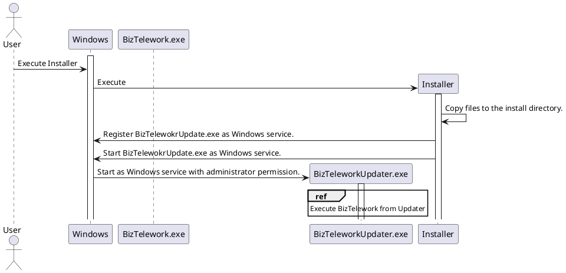
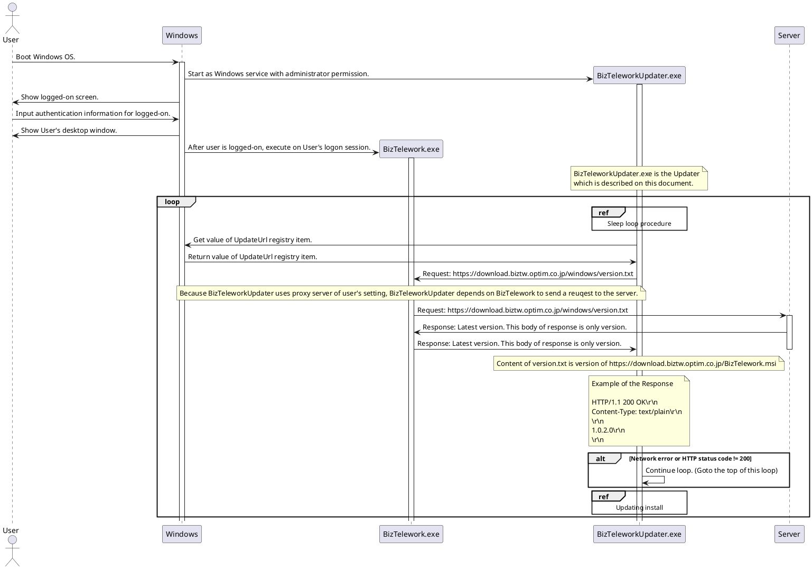
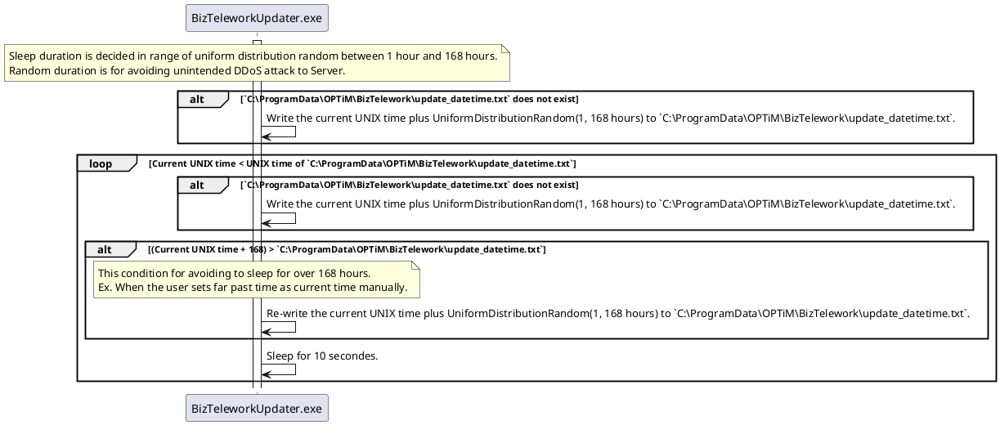
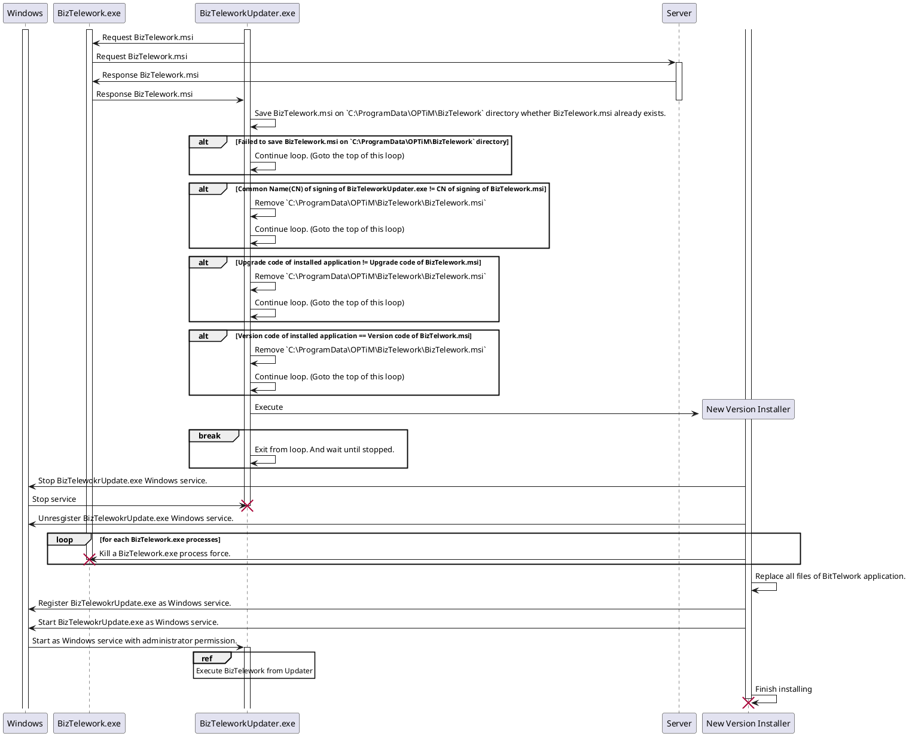

# Summary

Updater is a module that updates the BizTelework application and itself automatically.
This document describes how the updater is executed and updates BizTelework.

## Setup Updater

The updater will be installed by BizTelework.msi installer.

The installer also creates these registry entries.

* `UpdateUrl`
  * `UpdateUrl` shows API for checking update.
* `ExecuteBizTelework`
  * `ExecuteBizTelework` shows whether Updater should execute BizTelework every logged-in session.

The updater should be installed as Windows service.
Because the updater need the aministrator permission for executing a new version installer and BizTelework.exe on all user's sessions.

## The first installing about updater

This diagrams draws only the updater and relating files.



## Execute BizTelework from Updater

```plantuml
participant Windows
participant "BizTelework.exe" as BT
participant "BizTeleworkUpdater.exe" as Updater

activate Windows
activate Updater

Updater -> Windows: Get value of "ExecuteBizTelework" of Windows Registry
Windows -> Updater: Return value of "ExecuteBizTelework"

note over Updater
    Execute BizTelework process every logged on session after installed once.
end note

alt "ExecuteBizTelework" equals 1
    loop for each User logged-on sessions
        alt There is not BizTelework.exe process on the logged-on session
            create BT
            Updater -> BT: Execute on a user's logged-on session.
            activate BT
        end alt
    end loop

    note over Updater
        By settign 0 to "ExecuteBizTelework", Preventing that Updater execute BizTelework until next installation.
    end note
    Updater -> Windows: Set 0 to "ExecuteBizTelework"
    Windows -> Updater: Done

end alt
```

## Updater sequence



## Sleep loop sequence



## Updating install sequence


